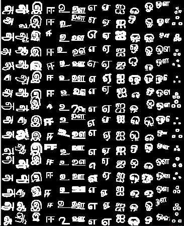
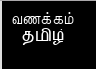

# அச்சு தமிழ் எழுத்துணரி செயற்கை நூண்ணறிவு பயிற்சித் தரவுத்தளம் உருவாக்கும் திட்டம்
**Project is to generate labeled data sets of Tamil letters**
Uyir, Mei, Uyirmei for 347 letter forms so that we are able to train classifiers based on this data.

# தமிழ் அரிச்சுவடி

This project is open-sourced under MIT License.

# Keras Models - ஆழக்கற்றல் மாதிரிகள் உருவாக்குதல்
1.  tfkeras_demo.py என்ற நிரல் கேராஸ் - டென்சார்ஃப்ளோ திரட்டின் வழி உருவாக்கலாம். இது CNN என்ற செயற்கைப்பின்னல் வழி 92% சரிவர பயிற்சி தரவிலும் 82% பரிசோதனைத்தரவிலும் சிறப்பாக செயல்படுகிறது.
    tfkeras_demo.py will train a simple 2-layer CNN for 92% training and 82% test accuracy.

# Outliers - சரியில்லாத சில தரவுபடங்கள்.
1. சில தரவிலுள்ள படங்களின் உருவங்கள் சரிவர இல்லாமல் உள்ளது. அதாவது எழுத்து வடிவ படம் 28x28 சதுரத்தி கொள்ளாமல் வெட்டுப்பட்டும், சட்டத்தில் வெளியில் "சிந்தியது போல்" காட்சிப்பட்டிருக்கும். இது சரியான பயிற்சிப்படம் இல்லை. இவற்றை outliers என்று கொண்டு இவற்றில் பயிற்சி தரவில் இருந்து நீக்கப்படவேண்டும்.

## Font Resources:
1. Thamizha Tamil fonts:
   https://github.com/thamizha/tamil-fonts
2. Tamil Fonts for various encodings
   http://tamilnation.co/digital/Tamil%20Fonts%20%26%20Software.htm#Unicode_Fonts
3. Apple Mac OS-X
   https://support.apple.com/en-us/HT206872#download

## MNIST data set meta-data
1. 60000x784 array of data and label of 60000x1
2. 60000 letter-images across all 13 letters for Tamil Uyir + Ayudham will make 4616 sets.
3. If we use 50 fonts, we will be required to make about 93 modified sets,
    for the same 13-data.
4. We need to make a font-list available to use as a config file.
5. 93 sets of 13-letters per font is what we want to come up with.
    93 - scale (use 2-fonts for) { translate, rotate }.
        - 93/4 ~ 23 translations, 23 rotations or 30 rotations and 16 translations.
6. Finally a PR version of data set is shown as a 16x13 composite of 28x28 px images. Which is 448x364 sized.
### Alternate algorithm using available Resources
1. Algorithm can use existing fonts with 20k set with rotation, 20kset with translation and 20k set with both rotation and translation in any order.
2. This will use a round-robin queue based method to train the data.
3. Roundrobin method provides 4616 samples of each label - pretty uniform.
4. Only 35 fonts of my collected data are suitable for Unicode processing.
    TAM/TAB fonts are nice but have significant overhead at this time.

## Memory capabilities
1. Matrix size of floats 60000x784 is easily loaded with size of 324MB in RAM.
